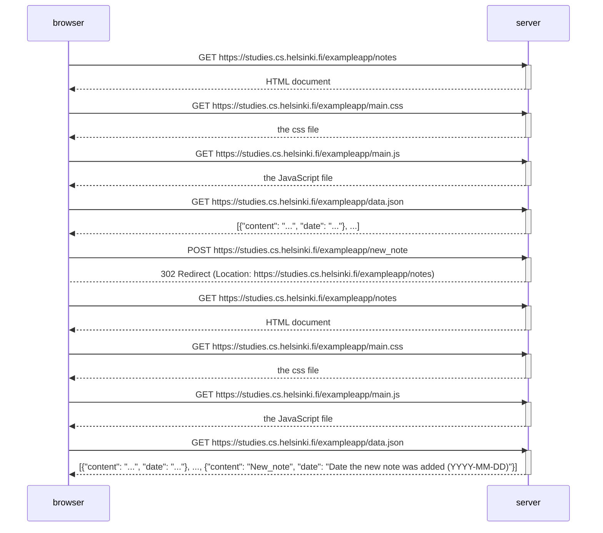

```mermaid

sequenceDiagram
  participant browser
  participant server

  browser->>server: GET https://studies.cs.helsinki.fi/exampleapp/notes
  activate server
  server-->>browser: HTML document
  deactivate server

  browser->>server: GET https://studies.cs.helsinki.fi/exampleapp/main.css
  activate server
  server-->>browser: the css file
  deactivate server

  browser->> server: GET https://studies.cs.helsinki.fi/exampleapp/main.js
  activate server
  server-->>browser: the JavaScript file
  deactivate server

  browser->>server: GET https://studies.cs.helsinki.fi/exampleapp/data.json
  activate server
  server-->>browser: [{"content": "...", "date": "..."}, ...]
  deactivate server

  browser->>server: POST https://studies.cs.helsinki.fi/exampleapp/new_note
  activate server
  server-->browser: 302 Redirect (Location: https://studies.cs.helsinki.fi/exampleapp/notes)
  deactivate server
  browser->>server: GET https://studies.cs.helsinki.fi/exampleapp/notes
  activate server
  server-->>browser: HTML document
  deactivate server

  browser->>server: GET https://studies.cs.helsinki.fi/exampleapp/main.css
  activate server
  server-->>browser: the css file
  deactivate server

  browser->> server: GET https://studies.cs.helsinki.fi/exampleapp/main.js
  activate server
  server-->>browser: the JavaScript file
  deactivate server

  browser->>server: GET https://studies.cs.helsinki.fi/exampleapp/data.json
  activate server
  server-->>browser: [{"content": "...", "date": "..."}, ..., {"content": "New_note", "date": "Date the new note was added (YYYY-MM-DD)"}]
  deactivate server
```
