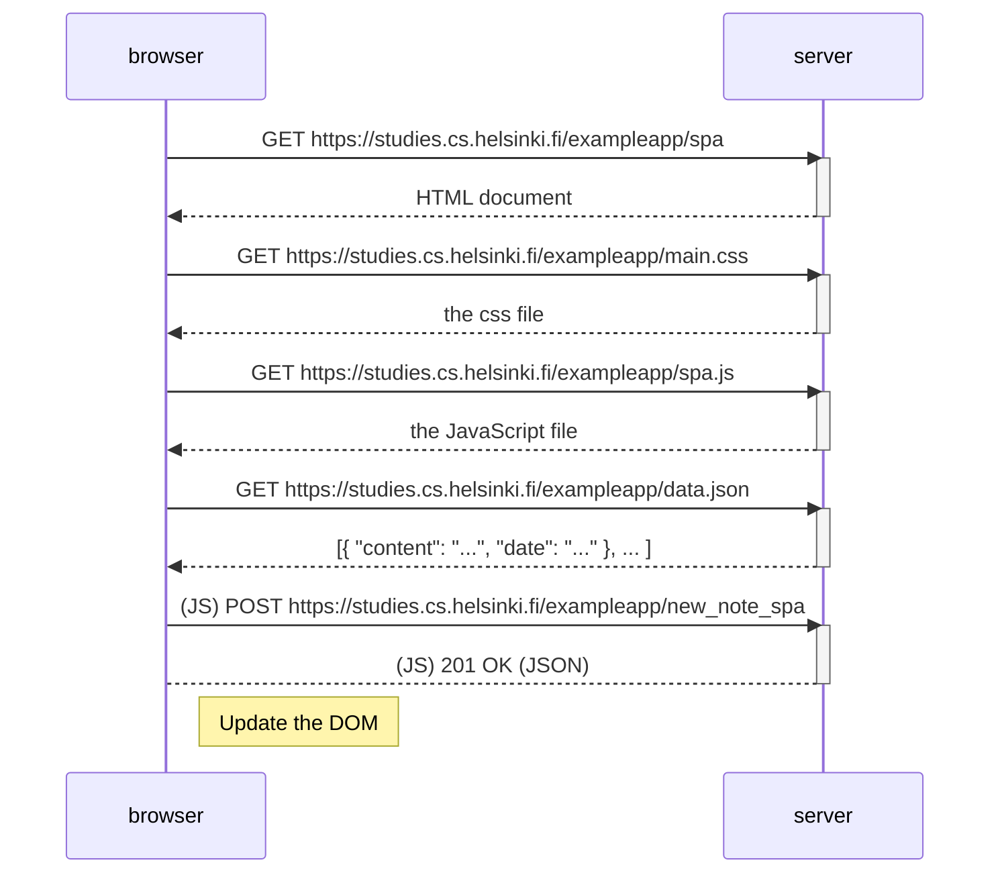

```mermaid

sequenceDiagram
  participant browser
  participant server

  browser->>server: GET https://studies.cs.helsinki.fi/exampleapp/spa
  activate server
  server-->>browser: HTML document
  deactivate server

  browser->>server: GET https://studies.cs.helsinki.fi/exampleapp/main.css
  activate server
  server-->>browser: the css file
  deactivate server

  browser->>server: GET https://studies.cs.helsinki.fi/exampleapp/spa.js
  activate server
  server-->>browser: the JavaScript file
  deactivate server

  browser->>server: GET https://studies.cs.helsinki.fi/exampleapp/data.json
  activate server
  server-->>browser: [{ "content": "...", "date": "..." }, ... ]
  deactivate server

  browser->>server: (JS) POST https://studies.cs.helsinki.fi/exampleapp/new_note_spa
  activate server
  server-->browser: (JS) 201 OK (JSON)
  deactivate server
  Note right of browser: Update the DOM

```
